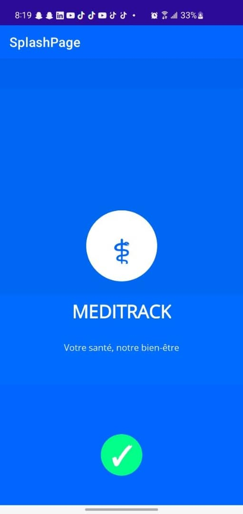
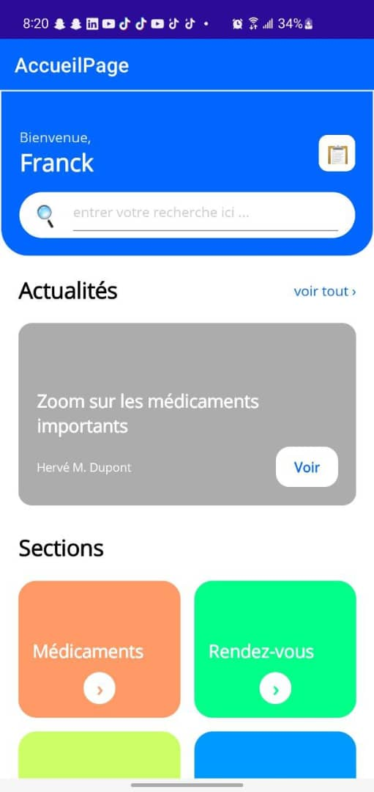
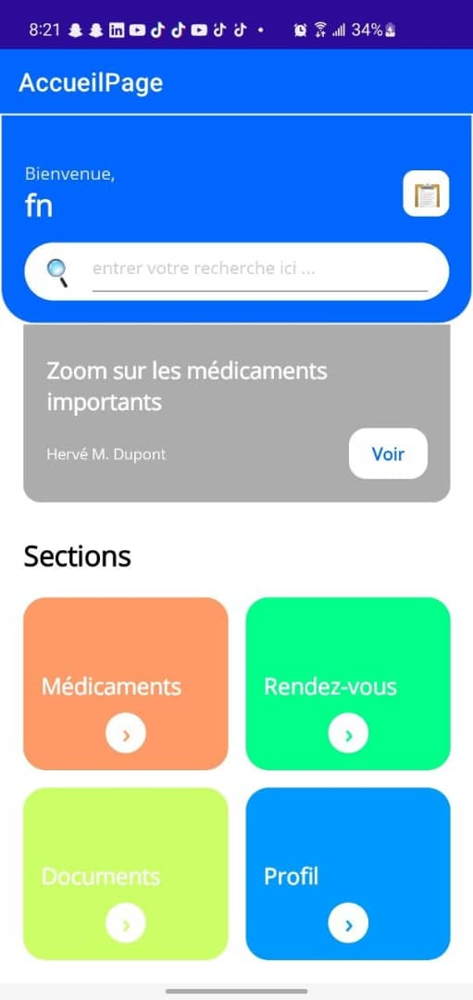
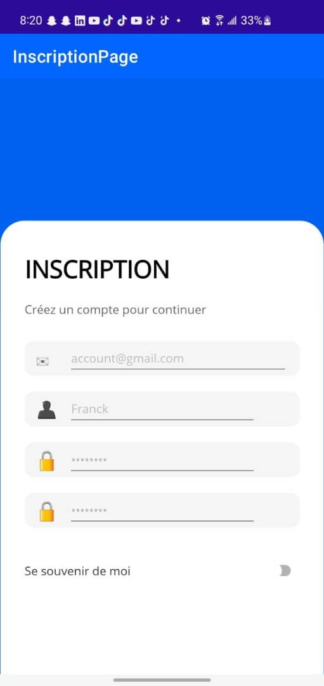
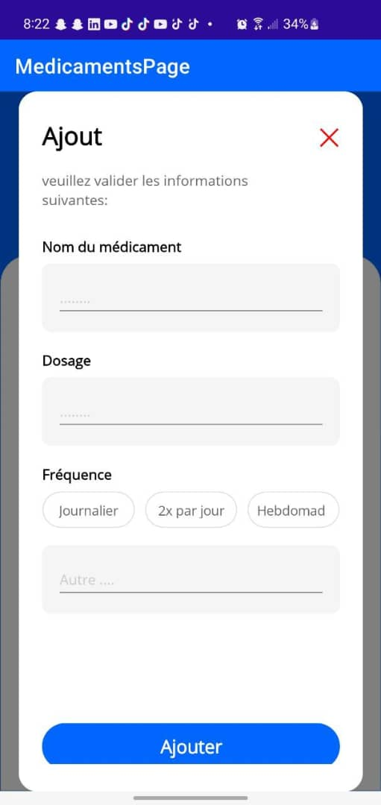
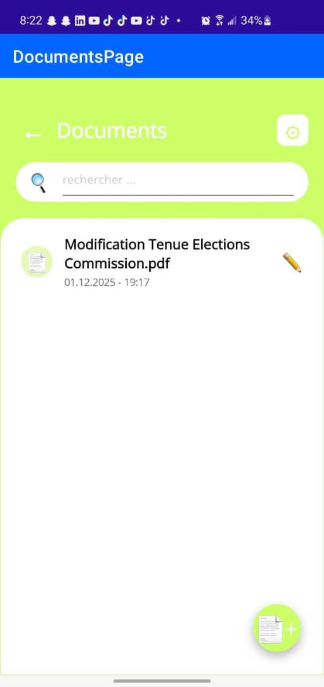
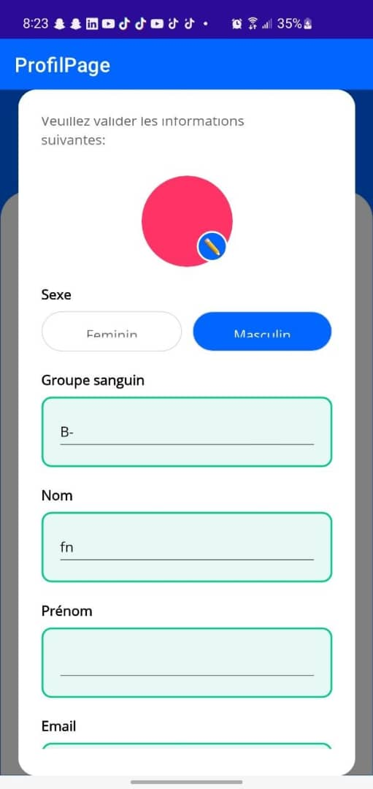
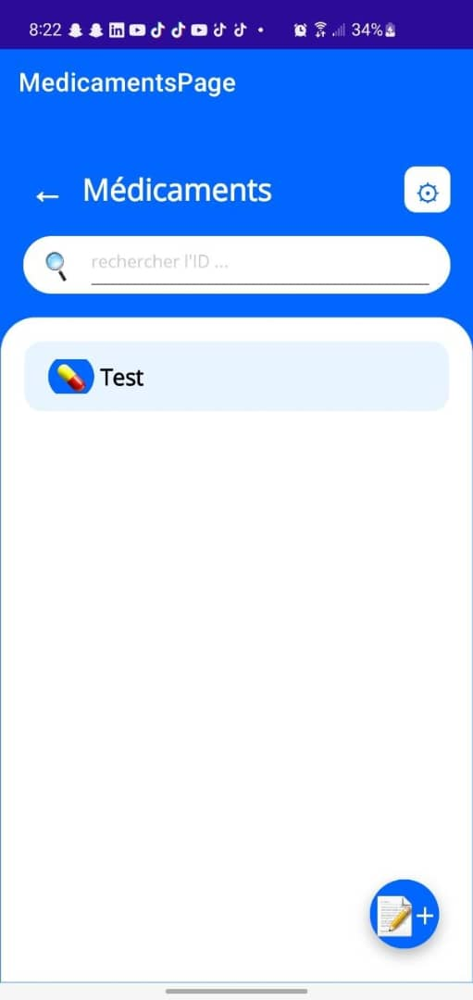
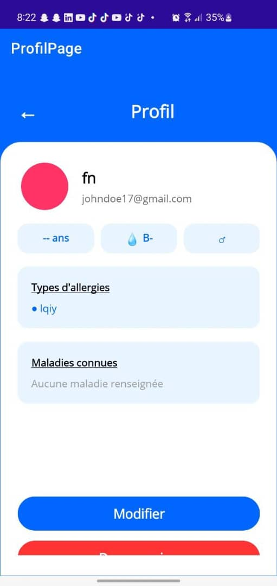

📘 MedTrack — Frontend (.NET MAUI)

Statut : Prototype fonctionnel
Technologie : .NET MAUI (MVVM)
Nom de l’application : MedTrack
But : Application mobile pour centraliser le suivi médical (médicaments, rendez-vous, documents, profil santé).

📄 Description courte

MedTrack est une application mobile développée en .NET MAUI utilisant une architecture MVVM.
Elle consomme une API REST (backend Node.js + Express / PostgreSQL).

L’application inclut :

Authentification

Gestion des médicaments

Rendez-vous médicaux

Gestion des documents (images / PDF)

Profil santé complet

Dashboard simple et ergonomique

📚 Table des matières

Installation

Fonctionnalités

Architecture & structure

API attendue

Configuration & stockage

Tests & validation

UI / Accessibilité / Écoconception

Déploiement / Packaging

Contribution

Licence

Résultats obtenus (Screenshots)

1️⃣ Installation
🔧 Prérequis

.NET SDK (8.0+ recommandé)

Workloads MAUI :

dotnet workload install maui

Android SDK + émulateur (ou appareil USB)

Node.js / Backend disponible

(iOS) macOS + Xcode si nécessaire

📥 Cloner le dépôt
git clone https://github.com/FankamNga/MedTrack_App.git
cd MedTrack
dotnet restore
dotnet build
dotnet maui run

📱 Lancement
▶️ Lancer sur Android
git clone <url-du-projet>
cd MedTrack
dotnet restore
dotnet build
dotnet maui run

2️⃣ Fonctionnalités (v1)

🔐 Authentification : inscription / connexion (JWT)
compte de test: user@example.com , password123

💊 Médicaments : CRUD (nom, dosage, fréquence)

📅 Rendez-vous : CRUD (date, lieu, type)

📄 Documents médicaux : upload + visualisation

👤 Profil santé : allergies, groupe sanguin, informations personnelles

🏠 Dashboard : accès rapide aux modules

🔁 Navigation simple et fluide

3️⃣ Architecture & structure du projet
🏛️ Pattern

MVVM

Services pour API + stockage local

Injection de dépendances

CommunityToolkit.Mvvm recommandé

📂 Arborescence
/src
  /MedTrack.App
    /Views
    /ViewModels
    /Models
    /Services
    /Resources
    App.xaml
    MainPage.xaml

🔑 Principes clés

ViewModels = logique métier

Services = API + persistance

API centralisée dans ApiService (gestion JWT)

4️⃣ API attendue (extraits)
🔐 Authentification

POST /api/auth/register

POST /api/auth/login

💊 Médicaments

GET /api/medicines

POST /api/medicines

PUT /api/medicines/{id}

📅 Rendez-vous

GET /api/appointments

POST /api/appointments

📄 Documents

POST /api/documents (multipart)

GET /api/documents/{id}

👤 Profil

GET /api/profile

PUT /api/profile

🔒 Sécurité

Header obligatoire :

Authorization: Bearer <token>

5️⃣ Configuration & stockage
📁 Fichier config
{
  "ApiBaseUrl": "https://med-track-back.vercel.app/",
  "TimeoutSeconds": 30
}

🔐 Stockage

JWT → SecureStorage

Préférences simples → Preferences

6️⃣ Tests & validation
🧪 Tests unitaires

Projet MedTrack.Tests

Mock de IApiService

🧭 Tests manuels

Vérification du CRUD complet

Authentification sécurisée

Visualisation documents

7️⃣ UI / Accessibilité / Écoconception

🎯 UX simple, boutons larges

🌗 Contraste lisible

📱 Responsive toutes tailles écrans

⚡ Images optimisées

💙 Thème sobre (bleu / gris)

8️⃣ Déploiement / Packaging
📦 Android

Build APK/AAB via .NET MAUI

🍏 iOS

Compilation via macOS + Xcode

🔐 Configuration

Variables backend versionnées séparément

Respect MVVM

Ajouter tests unitaires

🔟 Licence

MIT License (ou autre à préciser)

1️⃣1️⃣ Résultats obtenus (captures d’écran)

Le dossier des résultats : resultatsObtenus

Images utilisées :

ProfilePage.jpeg

Accueil.jpeg

Accueil1.jpeg

InscriptionPage.jpeg

ConnexionPage.jpeg

AjoutMedicament.jpeg

documentPage.jpeg

EditProfilePage.jpeg

MedicmentPage.jpeg

Onboard.jpeg

📸 Prévisualisation :

 
 
 
 
 
 
 
 
 

